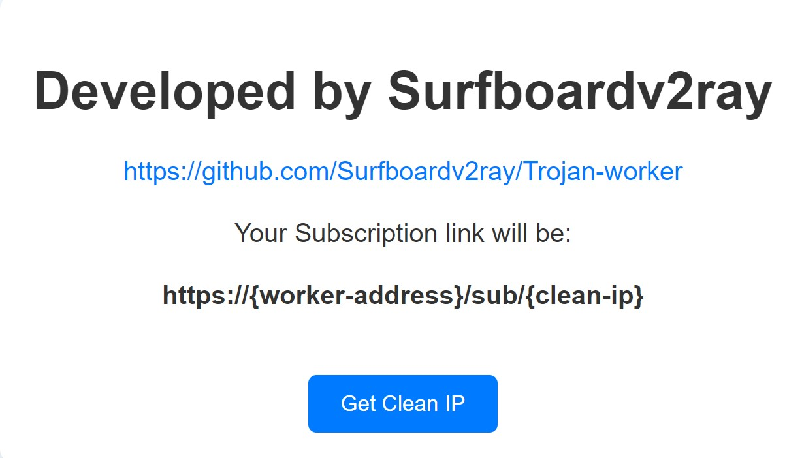

<h1 align="center">
  Trojan Worker
</h1>

<h2 align="center">
Access Trojan configs using Cloudflare CDN.
  <h3>
    English 🇬🇧 | <a href="README_FA.md">🇮🇷 فارسی</a>
  </h3> 
</h2>

## Introduction
🟢 Cloudflare has made it possible to run serverless configs and also access VPS configs via routing the traffic through the CDN.
In this script, we attempt to allow Trojan VPS configs to be used via Cloudflare CDN as well.

## Installation
1. Login or Signup at https://dash.cloudflare.com and verify your email address.
2. Head to `Workers and Pages` to create and name a worker.
3. Click `Edit Code` code to enter the editing environment.
4. Get the Latest version of the [Trojan script](https://github.com/Surfboardv2ray/Trojan-worker/releases/latest/download/worker.js), and copy the entire content.
5. Paste the content of the script onto the mentioned step 3 javascript editing environment.
6. Click `Deploy` located at top-right corner (Consider hitting Ctrl+S combo first if the Deploy button doesn't light up)
7. Your Worker subscription URL will be `https://{your_worker_address}.workers.dev/sub/{your_clean_ip}`

## Editing Source Links
🟡 You can add or change source subscription links over at `subLinks` in the initial part of the script. Both standard and base64 are supported.

🟡 Note that Vmess, Vless and Trojan configs with Websocket (WS), TLS and port 443 characteristics will be gathered.

## Additional Notes
🟡 To find Clean IPs for your subscription, consider using [Scanners](https://ircf.space/scanner.html).

  

## Stargazers

